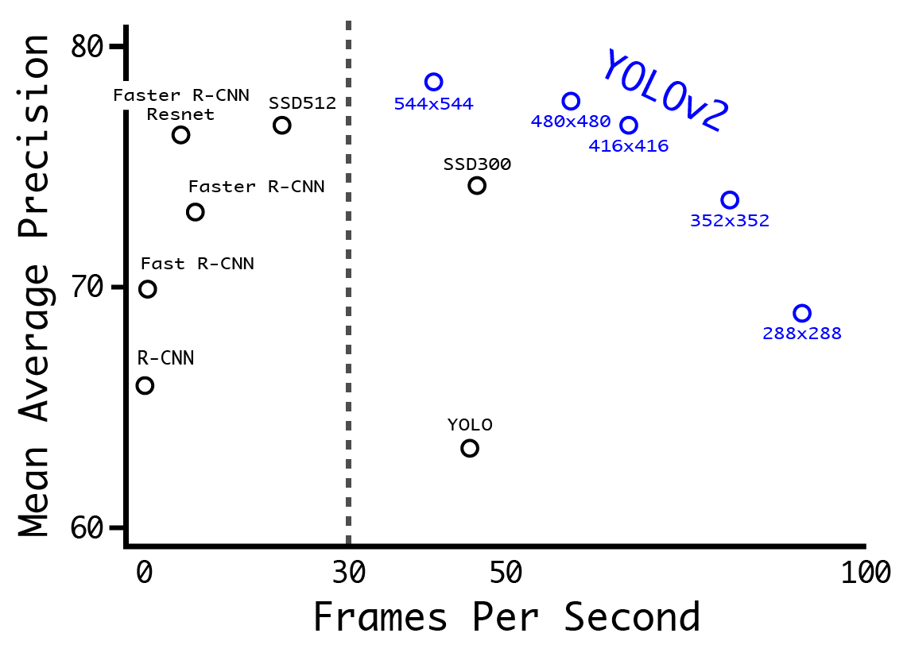

# Real-Time Vehicle Tracking Neural Network

Full Videos: [YouTube](https://www.youtube.com/watch?v=WXAghrx1DMA&index=14&list=PLMr_u-BsTKSoWrumKl-4sDf_keQxDZFaa)

The goal was to detect and track vehicles in a videostream using camera input. The first step was to callibrate the camera, and correct for distortion.

The classifier used here is the Tiny-YOLO neural-network which assists real-time object detection (better than Fast-RCNN or SSD etc). The network is pretrained on the VOC2012 dataset. The dataset has classes of *"aeroplane, bicycle, bird, boat, bottle, bus, car, cat, chair, cow, dining table, dog, horse, motorbike, person, potted plant, sheep, sofa, train, tv monitor".* The network doesn't need to be retrained, as we are interested in the car class, and can be sure that most other labels will not be seen.

YOLO-v2 processes frames at more than 30 FPS, while tiny-YOLO processes frames at approximately 21 FPS. The reduced NN architecture size is a trade-off with slightly lower test accuracy.The output of the DNN is a 1470 row vector that has information regarding probability [980], confidence [98], and bounding box coordinates [392] of predicted boxes, which is then processed to draw the bounding polytopes.

## Improvements
- As can be seen on the night-driving sample video, the bounding box disappears temporarily. This can be improved by retraining some of the layers of the NN on night time images, or by reducing the threshold of detection/acceptance of the bounding box.
